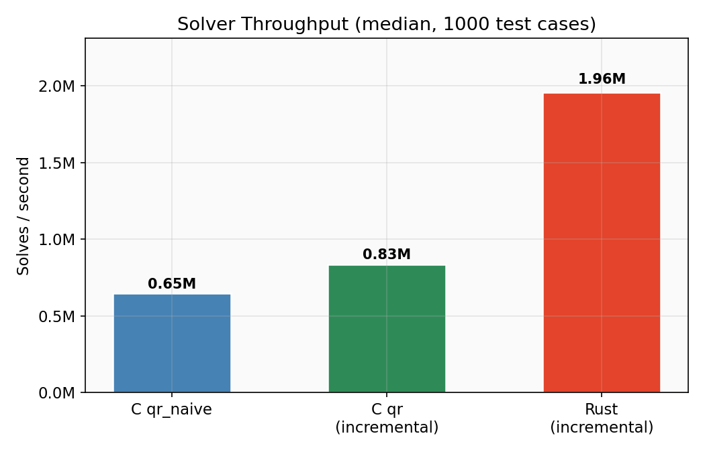
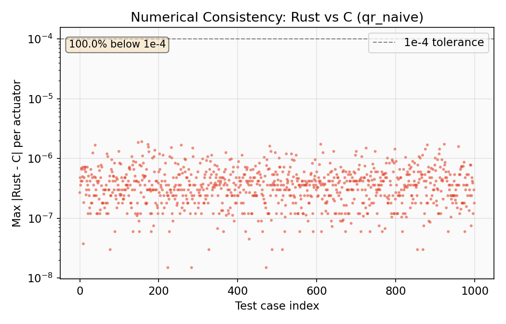
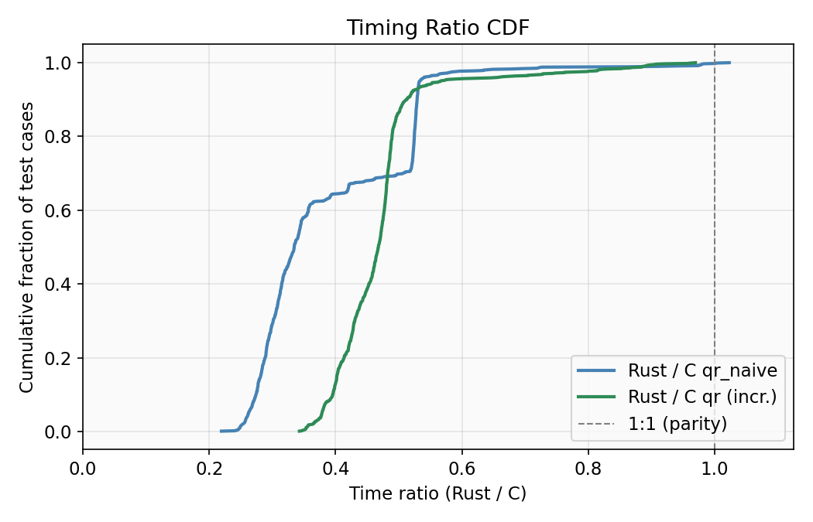

# wls-alloc

[](https://github.com/noidvan/wls-alloc/actions/workflows/ci.yml)
[](https://crates.io/crates/wls-alloc)
[](https://opensource.org/licenses/MIT)

Weighted Least-Squares (WLS) constrained control allocator for flight controllers.

Solves the box-constrained least-squares problem:

$$\min_u \lVert A u - b \rVert^2 \quad \text{s.t.} \quad u_{\min} \le u \le u_{\max}$$

using an active-set method with incremental QR updates (Givens rotations).
Designed for real-time motor mixing: `no_std`, fully stack-allocated, const-generic
over problem dimensions.

## Use case

Given a desired thrust/torque vector and a motor effectiveness matrix, compute
the optimal per-motor throttle commands that best achieve the objective while
respecting actuator limits.

## Quick start

```rust
use wls_alloc::{setup_a, setup_b, solve, ExitCode, VecN, MatA};

// Problem dimensions: NU=4 motors, NV=6 pseudo-controls, NC=NU+NV=10
let g: MatA<6, 4> = /* your effectiveness matrix */;
let wv: VecN<6> = VecN::from_column_slice(&[10.0, 10.0, 10.0, 1.0, 0.5, 0.5]);
let mut wu: VecN<4> = VecN::from_column_slice(&[1.0; 4]);

// Build the LS problem
let (a, gamma) = setup_a::<4, 6, 10>(&g, &wv, &mut wu, 2e-9, 4e5);
let v: VecN<6> = /* desired pseudo-control */;
let u_pref: VecN<4> = VecN::from_column_slice(&[0.5; 4]);
let b = setup_b::<4, 6, 10>(&v, &u_pref, &wv, &wu, gamma);

// Solve (ws persists between calls for warmstarting)
let umin: VecN<4> = VecN::from_column_slice(&[0.0; 4]);
let umax: VecN<4> = VecN::from_column_slice(&[1.0; 4]);
let mut us: VecN<4> = VecN::from_column_slice(&[0.5; 4]);
let mut ws = [0i8; 4]; // working set: 0=free, +1=at max, -1=at min
let stats = solve::<4, 6, 10>(&a, &b, &umin, &umax, &mut us, &mut ws, 100);

assert_eq!(stats.exit_code, ExitCode::Success);
// us now contains the optimal motor commands
```

## Features

- **`no_std`** - no heap allocation, fully stack-based. Runs on bare-metal `thumbv7em-none-eabihf`.
- **Const-generic dimensions** - `solve::<NU, NV, NC>(...)` monomorphizes to exact-sized code. No wasted memory.
- **Incremental QR** - initial factorization via [nalgebra](https://nalgebra.org)'s Householder QR, then Givens rotation updates when constraints activate/deactivate. $O(n)$ per constraint change vs $O(n^3)$ re-factorization.
- **Warmstarting** - the working set (`ws`) persists between calls. With `imax=1`, the solver typically converges in a single iteration during steady flight.
- **NaN-safe** - detects NaN in the QR solution and reports `ExitCode::NanFoundQ` / `ExitCode::NanFoundUs`. No `-ffast-math` assumptions.

## Algorithm

The solver converts the weighted least-squares control allocation problem:

$$\min_u \lVert G u - v \rVert^2_{W_v} + \gamma^2 \lVert u - u_{\text{pref}} \rVert^2_{W_u} \quad \text{s.t.} \quad u_{\min} \le u \le u_{\max}$$

into a standard box-constrained least-squares problem $\min \lVert A u - b \rVert^2$ via
`setup_a()` / `setup_b()`, where:

$$A = \begin{bmatrix} W_v G \\ \gamma W_u \end{bmatrix}, \quad b = \begin{bmatrix} W_v v \\ \gamma W_u u_{\text{pref}} \end{bmatrix}$$

The regularization parameter $\gamma$ is automatically estimated from the
Gershgorin disk bounds of $(W_v G)(W_v G)^\top$ to maintain a target condition number.

The active-set solver then iterates:
1. Solve the unconstrained subproblem for free variables via QR back-substitution
2. If feasible: check optimality via Lagrange multipliers $\lambda_i$; free the most non-optimal bound
3. If infeasible: step to the nearest constraint boundary via line search

## Benchmarks

Compared against the original C implementation
([ActiveSetCtlAlloc](https://github.com/tudelft/ActiveSetCtlAlloc)) on 1000 test
cases ($n_u = 6$, $n_v = 4$, cold start, `imax=100`). Both compiled with maximum
optimization for the same host: GCC `-O3 -march=native` vs Rust `--release`,
with matching array sizes (`AS_N_U=6, AS_N_V=4`).

### Throughput



| Metric | C qr_naive | C qr (incr.) | Rust (incr.) |
|--------|-----------|-------------|-------------|
| Median | 1541 ns | 1200 ns | 511 ns |
| P95 | 2321 ns | 1454 ns | 728 ns |
| P99 | 2517 ns | 1567 ns | 1019 ns |
| Throughput | 0.65M/s | 0.83M/s | **1.96M/s** |

**~2.3x faster** than C incremental QR, **~3x faster** than C naive QR.

### Numerical consistency



100% of test cases match the C reference within $10^{-4}$ tolerance.
Maximum absolute difference: $1.91 \times 10^{-6}$. Median: $3.58 \times 10^{-7}$.

### Timing ratio



The Rust solver is faster than C on every single test case (ratio $< 1.0$ for 100%
of cases).

## API

### Types

```rust
// Convenience aliases (or use nalgebra types directly)
type MatA<NC, NU> = OMatrix<f32, Const<NC>, Const<NU>>;
type VecN<N> = OVector<f32, Const<N>>;
```

### Functions

- `setup_a::<NU, NV, NC>(g, wv, wu, theta, cond_bound) -> (MatA, gamma)` - build the $A$ matrix
- `setup_b::<NU, NV, NC>(v, u_pref, wv, wu, gamma) -> VecN<NC>` - build the $b$ vector
- `solve::<NU, NV, NC>(a, b, umin, umax, us, ws, imax) -> SolverStats` - solve the problem

### Exit codes

| Code | Meaning |
|------|---------|
| `Success` | Optimal solution found |
| `IterLimit` | `imax` iterations reached (solution is best so far) |
| `NanFoundQ` | NaN in QR solution (degenerate problem) |
| `NanFoundUs` | NaN during constraint step |

## Origin

This crate is a Rust port of the C
[ActiveSetCtlAlloc](https://github.com/tudelft/ActiveSetCtlAlloc) library by
Till Blaha (TU Delft MAVLab).
